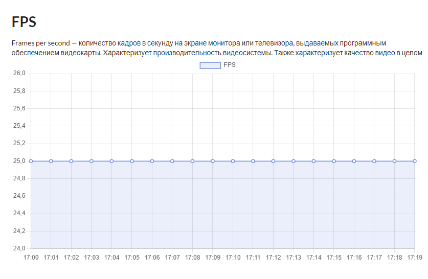
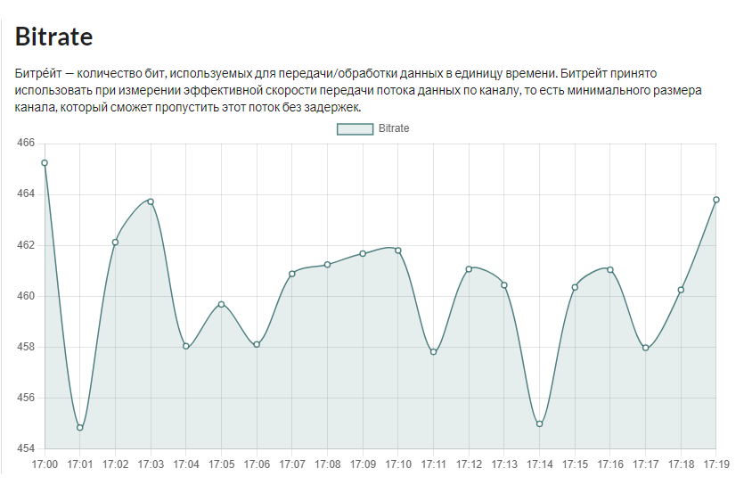
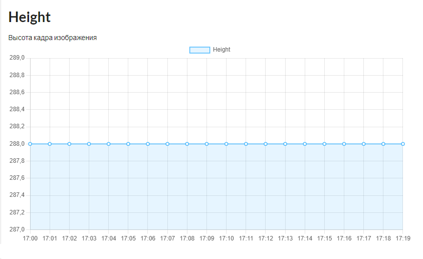
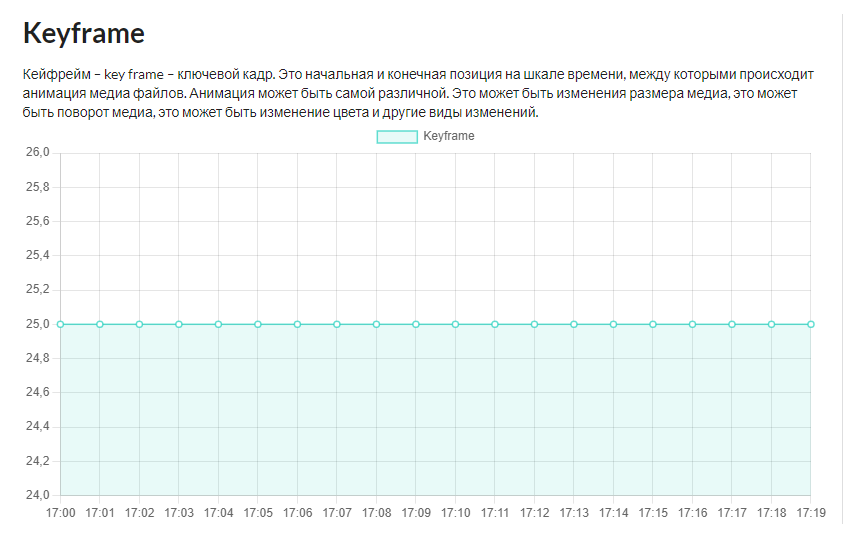
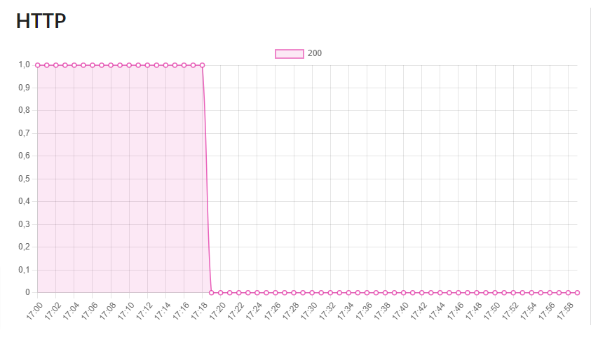
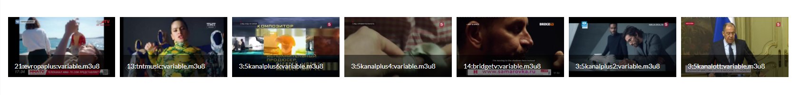
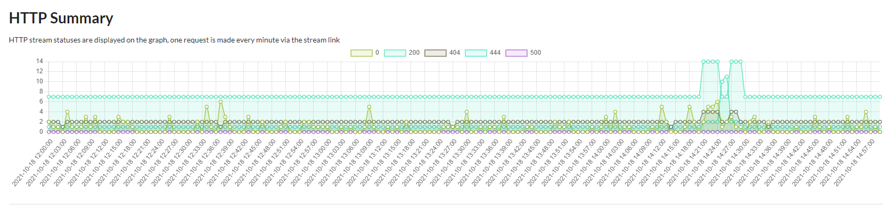
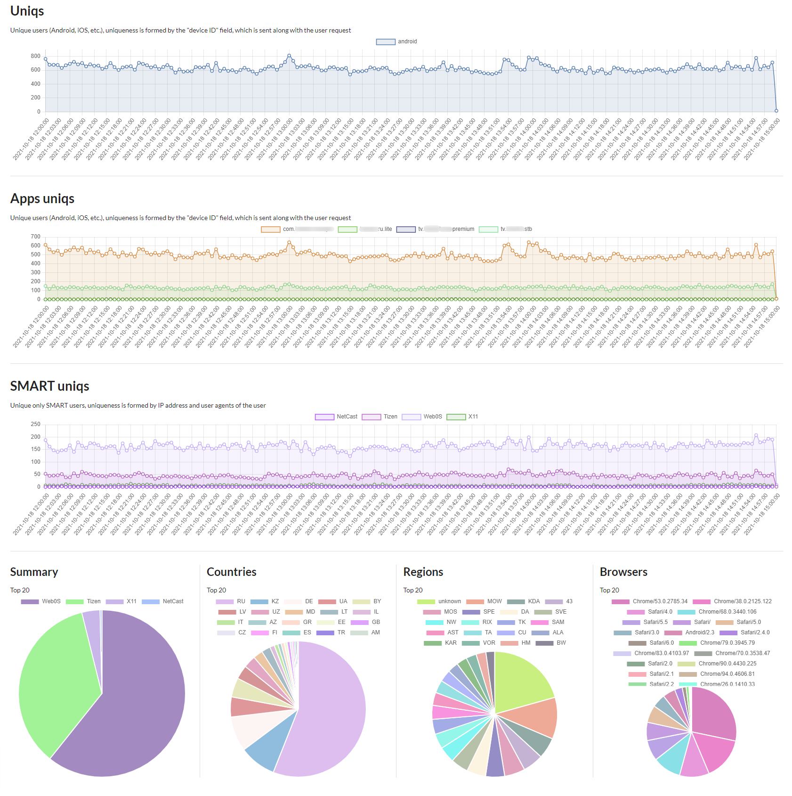

## Glance

**Glance** is a portable, event-driven, 
package for building monitoring applications for your streams (HLS, RTMP, SRS, MPEG-DASH, RTSP, WebRTC).

### Support

#### Metrics

Collects basic metrics from the stream, such as FPS, bitrate, height, keyframes and possibly something 
else in the future

FPS | Bitrate | Height | Keyframe | HTTP |
| ----------- | ----------- | ----------- | ----------- | ----------- |
 |  |  |  |  |

##### Available storages

  - [x] **Clickhouse**
  - [ ] **Influxdb**
  - [ ] Other: **mysql, postgres, mssql** (all this is done easily by implementing the appropriate interface)

#### Screenshots 

Take screenshots with some frequency, there is a possibility of a customizable link to the images. 

#### HTTP checker 

Periodically (configurable) checks the statuses of HTTP responses of the stream

### Customizable

You can implement support for graphs of any type using the built-in query builder and native support for parametric queries, 
such as: date and time, granularity (minute, 5 minutes, 15 minutes, 1 hour, 1 day, 1 week, 1 month and you can still)

